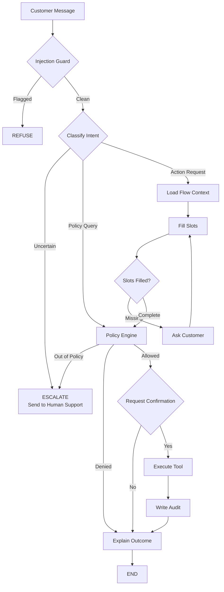

# End-to-End Servicing Agents (Mobile App & Web App)

A conversational card-servicing platform where the LLM handles the conversation, a
deterministic policy engine makes every decision, and a hash-chained audit trail
records all of it. The product has two frontends: a **customer mobile app** and a
**bank conversation auditor** web console.

---

## 1. Technology Stack

| Layer             | Technology                       |
| ----------------- | -------------------------------- |
| Frontend (web)    | React, Next.js                   |
| Frontend (mobile) | React Native                     |
| Backend & APIs    | Node.js, FastAPI                 |
| Conversational AI | GPT-4 API with RAG and LangGraph |
| Audit & logging   | AWS                              |
| Cloud platforms   | AWS, GCP                         |
| Databases         | PostgreSQL, MongoDB              |
| Local development | Docker                           |
| Architecture      | Hexagonal (ports & adapters)     |

---

## 2. Customer Mobile App

### 2.1 Home

Landing page showing the customer's banking overview:

- Number of accounts
- Credit and debit cards list
- Self-transfer between accounts
- Manage cards
- Notifications
- Search
- Logout (fast session expiry)

### 2.2 Cards

- Card holding details
- Manage cards
- Account statement
- Get statement
- Available balance
- Raise dispute and report fraud

### 2.3 Reach Us (Core Feature)

AI assistance for card-servicing requests, prioritized by urgency:

**Priority — High**

- Fee reversal
- Credit limit increase
- Card replacement

**Priority — Medium**

- Freeze and unfreeze card
- Autopay setup
- Payment date change
- Address / phone / email update

### 2.4 Settings

**Preferences**

- Language
- Theme
- Insta alerts
- Face ID (or other security factor for login)

**Support and services**

**My profile**

- Customer ID
- Personal details
- KYC details (secure)

---

## 3. Auditor Console (Bank Side)

A support-desk web console where bank staff monitor and take over AI-agent
conversations. Reference UX: Chatwoot / PaperLayer style inbox.

### 3.1 Settings

### 3.2 My Inbox

**Conversations**

- All conversations
- Mentions
- Unattended
- _(No Folders, Teams, or Channels)_

### 3.3 Conversations (WebSocket connection)

- Mine
- Unassigned
- All
- Chat box — can see AI-agent chats with customers
- Self-assign conversations
- Set priority

### 3.4 Contact

- Contact details only _(no Copilot or other extras)_

---

## 4. Agent Decision Flow

The LLM never decides an outcome on its own. Every customer message runs through an
injection guard, intent classification, deterministic slot-filling, and a policy
engine. Only policy-allowed and customer-confirmed actions execute a tool, and every
executed action writes to the audit trail.

### Flow stages

1. **Injection Guard** — screens the message for prompt-injection / abuse. Flagged
   messages are refused.
2. **Classify Intent** — routes to a policy query or an action request. Uncertain
   classifications escalate to human support.
3. **Load Flow Context / Fill Slots** — for action requests, gathers the required
   fields; if any are missing the agent asks the customer and loops.
4. **Policy Engine** — deterministic decision: `Allowed`, `Denied`, or `Out of
Policy` (escalates).
5. **Request Confirmation** — an allowed action is only executed after explicit
   customer confirmation.
6. **Execute Tool** — performs the servicing action.
7. **Write Audit** — appends a hash-chained audit record.
8. **Explain Outcome** — the agent explains the result to the customer.
